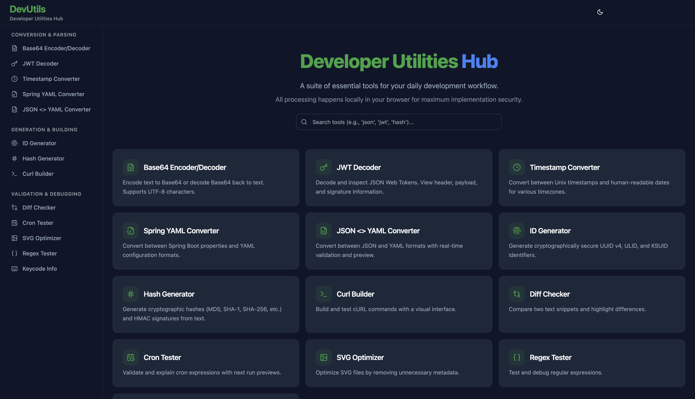

# Developer Utilities Hub

A collection of browser-based developer tools built with React, TypeScript, and Tailwind CSS. All processing happens **locally in your browser** — no data is ever sent to a server.



## ✨ Tools

| Tool | Description | Category |
|---|---|---|
| **Base64 Encoder/Decoder** | Encode/decode Base64 with UTF-8 support | Conversion |
| **JWT Decoder** | Inspect JWT header, payload, and signature | Conversion |
| **Timestamp Converter** | Convert Unix timestamps ↔ human-readable dates | Conversion |
| **Spring YAML Converter** | Convert between `.properties` and YAML formats | Conversion |
| **JSON ↔ YAML** | Bi-directional JSON/YAML converter | Conversion |
| **UUID/ULID/KSUID Generator** | Generate unique identifiers with formatting options | Generation |
| **Hash Generator** | MD5, SHA-1/256/512, RIPEMD-160, HMAC hashing | Generation |
| **cURL Builder** | Construct cURL commands with headers and body | Generation |
| **Regex Tester** | Test regex patterns with live matching and presets | Validation |
| **Diff Checker** | Compare text with char/word/line/JSON diff modes | Validation |
| **Cron Expression Tester** | Validate cron expressions with Quartz support | Validation |
| **SVG Optimizer** | Optimize SVG files with SVGO (multi-pass) | Conversion |
| **Keycode Info** | Inspect keyboard, mouse, wheel, and touch events | Validation |

## 🛠 Tech Stack

- **Framework**: React 18 + TypeScript 5
- **Build Tool**: Vite 5
- **Styling**: Tailwind CSS 3 + Radix UI primitives
- **State**: Zustand, React hooks
- **Routing**: React Router v6

## 🚀 Quick Start

```bash
# Install dependencies
npm install

# Start dev server (http://localhost:5173)
npm run dev

# Production build
npm run build

# Preview production build
npm run preview
```

## 📁 Project Structure

```
src/
├── components/
│   ├── layout/          # ToolShell, Navbar, ErrorBoundary, ToolSkeleton
│   └── ui/              # Button, Input, Card, Tabs, etc. (shadcn/ui)
├── config/
│   └── tools.config.tsx # Tool registry (routes, icons, lazy imports)
├── hooks/               # useCopyToClipboard, etc.
├── lib/                 # cn() utility
├── tools/               # Each tool in its own folder
│   └── <tool>/
│       ├── index.tsx           # Tool UI component
│       ├── <tool>.types.ts     # TypeScript interfaces
│       └── <tool>.utils.ts     # Pure logic (JSDoc-documented)
└── routes.tsx           # Route definitions + homepage
```

## 📜 Available Scripts

| Script | Description |
|---|---|
| `npm run dev` | Start Vite dev server with HMR |
| `npm run build` | Type-check + production build |
| `npm run preview` | Preview the production build |
| `npm run type-check` | TypeScript compiler check (`tsc --noEmit`) |
| `npm run lint` | ESLint with zero-warning policy |
| `npm run format` | Format source files with Prettier |

## 🐳 Deployment (AWS EKS)

The project includes production-ready Docker configuration files:
- **[Dockerfile](./Dockerfile)** — Multi-stage build with Node.js 20 + nginx Alpine
- **[nginx.conf](./nginx.conf)** — SPA routing, caching, security headers, gzip compression

### Build and Test Locally

```bash
# Build Docker image
docker build -t dev-utilities-hub .

# Run locally on port 8080
docker run -p 8080:80 dev-utilities-hub

# Visit http://localhost:8080
```

### Deploy to AWS EKS

```bash
# 1. Authenticate with ECR
aws ecr get-login-password --region us-east-1 | \
  docker login --username AWS --password-stdin <ECR_REGISTRY>

# 2. Build and tag
docker build -t <ECR_REGISTRY>/dev-utilities-hub:latest .

# 3. Push to ECR
docker push <ECR_REGISTRY>/dev-utilities-hub:latest

# 4. Deploy to EKS (see Kubernetes manifest below)
kubectl apply -f k8s-deployment.yaml
```

### Kubernetes Deployment

```yaml
apiVersion: apps/v1
kind: Deployment
metadata:
  name: dev-utilities-hub
spec:
  replicas: 2
  selector:
    matchLabels:
      app: dev-utilities-hub
  template:
    metadata:
      labels:
        app: dev-utilities-hub
    spec:
      containers:
        - name: dev-utilities-hub
          image: <ECR_REGISTRY>/dev-utilities-hub:latest
          ports:
            - containerPort: 80
          resources:
            requests:
              cpu: 50m
              memory: 64Mi
            limits:
              cpu: 200m
              memory: 128Mi
---
apiVersion: v1
kind: Service
metadata:
  name: dev-utilities-hub
spec:
  type: ClusterIP
  ports:
    - port: 80
      targetPort: 80
  selector:
    app: dev-utilities-hub
```

## 📝 License

Private — internal use only.
